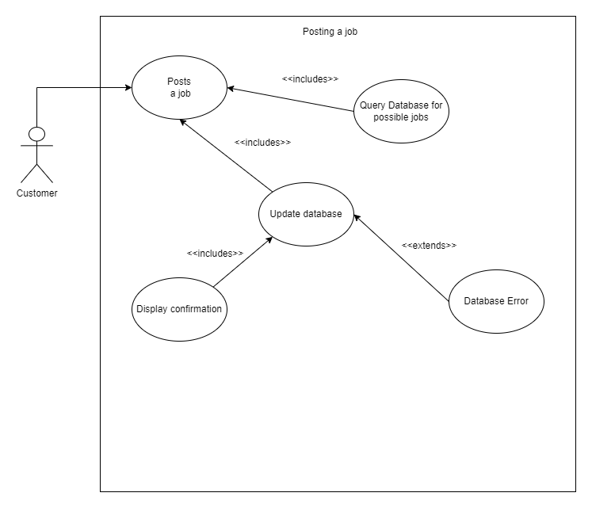
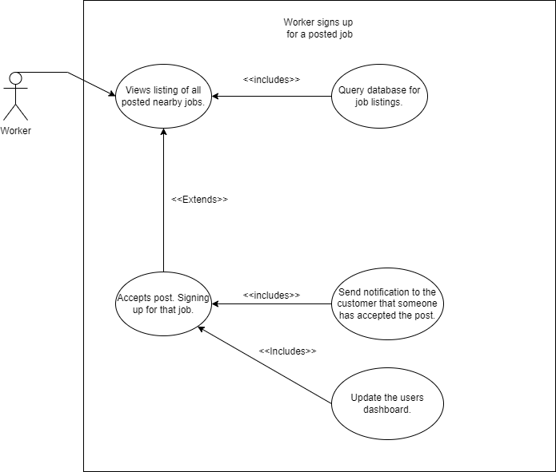
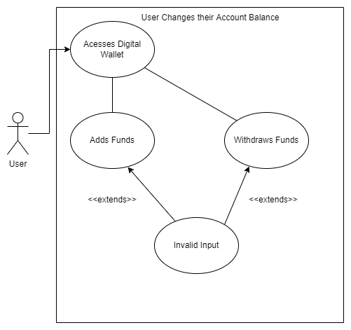
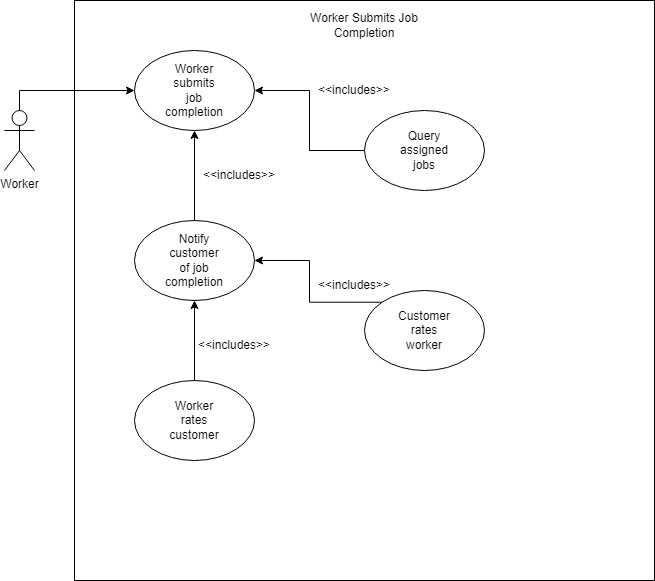
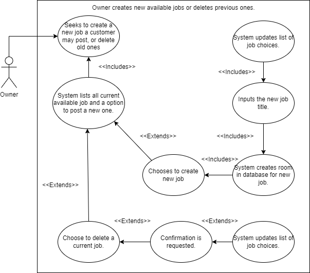
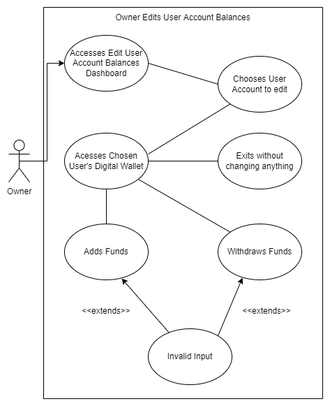
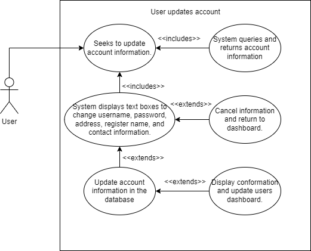

# Use Case Diagrams

## 1 \- Customer posts a job

Participating actor/s: Customer

Entry Conditions:

- The customer is seeking a worker for the job they are posting

Exit conditions:

- The customer cancels/stops posting a job
- The customer successfully posts a job listing to the website

Event Flow:

1. Customer logs in or signs up
2. System queries and displays what jobs are available to post about
3. Customer picks which job they would like done and when
4. Customer chooses how they would like to pay
5. Customer submits the post to the system
6. Customer receives confirmation of posting
7. Customers dashboard is updated to display the job

## 2 \- Worker Signs up for a job.

Participating actor/s: Worker

Entry Conditions:

- The worker is seeking a job posting

Exit conditions:

- The worker decides to not pick any job postings
- The worker picks a posting and clicks to accept the work

Event Flow:

1. Worker logs in or signs up
2. Worker clicks the view job listings page
3. System displays all nearby job listings
4. Worker selects a job listing they would like to do
5. Worker confirms that they would like to complete this job
6. Worker receives confirmation of choice
7. A notification is sent to the customer, confirming the worker
8. The workers Dashboard is updated to display the job

## 3 \- User changes their account balance (Money)

Participating actor/s: User

Entry Conditions:

- User Accesses Wallet

Exit conditions:

- User adds funds
- User withdraws funds

Event Flow:

1. User accesses their digital wallet (Found on their account page). The wallet displays their current balance and allows them to enter a value to add or withdraw funds
2. The user chooses whether to add or withdraw funds from their wallet
3. If add:
    1. Funds are added to the user's digital wallet, unless the value provided by the user was invalid
4. If withdraw:
    1. Funds are withdrawn from the user's digital wallet, unless the value provided by the user was invalid

## 4 \- Worker submits job completion.

Participating actor/s: Worker

Entry Conditions:

- The worker submits that they have completed the job

Exit conditions:

- Worker is compensated, and both parties are asked to leave reviews

Event Flow:

1. The worker confirms that they have completed the job
2. The customer is notified of the job completion
3. The worker is asked to review the customer
4. The customer compensates the worker for the job
5. The customer is asked to review the worker

## 5 \- Owner creates new available jobs or deletes old ones.

Participating Actor/s: Owner

Entry Conditions:

- Owner seeks to add or remove available job posts

Exit Conditions:

- The owner adds a new job to the list
- The owner cancels the endeavor
- The owner deletes a job from the list

Event Flow:

1. Owner clicks to add or remove available job posts
2. Owner is presented with a list of all jobs available to delete, or can click to add a new one
3. If clicking for a new one:
    1. The database creates space for the new entry
    2. The owner inserts a new job title
    3. The owner is redirected to the dashboard and the system updates the list of job choices
7. If deleting one:
    1. The owner clicks on one to delete
    2. The updates reflect job options minus deleted choices

## 6 \- Owner edits user account balances

Participating Actor/s: Owner

Entry Conditions:

- Owner accesses dashboard for editing the balances of user accounts

Exit Conditions:

- Owner adds funds
- Owner withdraws funds
- Owner exits without doing anything

Event Flow:

1. Owner accesses dashboard for editing the balances of user accounts (Located on owner dashboard). This displays a list of all users and shows their current account balance
2. Owner chooses an account to edit
3. Owner accesses the chosen user's digital wallet. The wallet displays their current balance and allows the owner to enter a value to add or withdraw funds
4. The owner chooses whether to add or withdraw funds from the chosen user's wallet or to exit without doing anything
5. If add:
    1. Funds are added to the user's digital wallet, unless the value provided by the user was invalid
6. If withdraw:
    1. Funds are withdrawn from the user's digital wallet, unless the value provided by the user was invalid
7. If exit:
    1. The user's digital wallet balance is unchanged.

## 7 \- User creates an account

Participating Actor/s: User

Entry Conditions:

- The user seeks to create an account

Exit Conditions:

- User doesn’t accept terms and conditions
- User Fills in mandatory information and accepts terms and conditions

Event Flow:

1. User clicks the button to create a new account
2. System displays boxes requesting the user's information
3. System displays terms and conditions
4. If accepted:
    1. The users account is created
    2. They are forwarded to their dashboard
7. If not accepted:
    1. The account is nullified

## 8 \- User modifies account

Participating actor/s: User

Entry Conditions:

- The user seeks to modify their account information

Exit conditions:

- User saves new account information
- User exits without saving

Event Flow:

1. The user presses to change account information
2. The user is presented with text boxes to change current information
3. The user inputs any information they would like changed
4. The user submits or cancels the information change
5. The system changes any information in the database necessary
6. Confirmation is displayed and the users dashboard is updated with any new information
